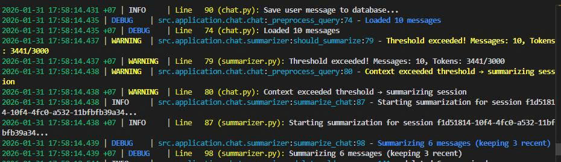
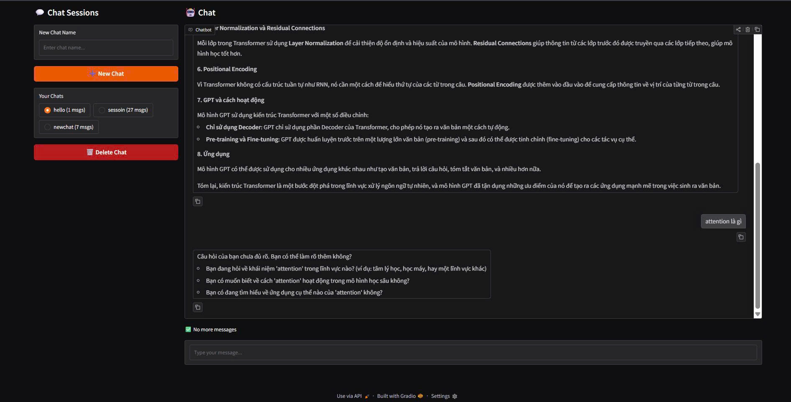

# Chat Assistant with Session Memory & Query Understanding

A production-ready demo of an intelligent chat assistant implementing **automatic session memory** via summarization and **query understanding** with ambiguity detection.

## 🎯 Overview

This project demonstrates two core AI assistant capabilities:

1. **Session Memory via Automatic Summarization** - Automatically condenses long conversations into structured summaries when context exceeds token limits
2. **Query Understanding Pipeline** - Detects ambiguous queries, rewrites them using context, and generates clarifying questions when needed

### Key Focus Areas

- Clear pipeline design (query → memory → understanding → response)
- Schema-first structured outputs (Pydantic validation)
- Proper context & memory management

---

## ✨ Features

### 1️⃣ Session Memory via Automatic Summarization

- **Automatic trigger**: Summarization kicks in when conversation context exceeds configurable token threshold
- **Token counting**: Uses `tiktoken` for accurate token approximation
- **Structured summaries**: Generates Pydantic-validated summaries with:
  - `user_profile` (preferences, constraints)
  - `key_facts` (important information)
  - `decisions` (choices made during conversation)
  - `open_questions` (unresolved topics)
  - `todos` (action items)
- **Smart storage**: Saves summaries to PostgreSQL and soft-deletes old messages while keeping recent N messages for continuity

### 2️⃣ Query Understanding Pipeline

Each incoming query goes through:

**Step 1: Ambiguity Detection & Rewrite**
- Detects if query is ambiguous given conversation context
- Rewrites query using session memory if possible

**Step 2: Context Augmentation**
- Combines recent N messages with session summary
- Builds enriched context for LLM

**Step 3: Clarifying Questions**
- If query remains unclear, generates 1–3 clarifying questions
- Returns questions instead of guessing answers

All LLM outputs are validated using **Pydantic schemas** for reliability.

---

## 🏗️ Architecture

```
User Query
    │
    ▼
Save User Message
    │
    ▼
Load Recent Messages (limit=MAX_CONTEXT_MESSAGES)
    │
    ▼
Token Count Check (should_summarize?)
    │
    ├─── YES ──> Summarize Session
    │              │
    │              ├─> Generate Structured Summary
    │              ├─> Store in Database
    │              └─> Soft-delete Old Messages
    │
    └─── NO ───> Load Latest Summary (if exists)
    │
    ▼
Query Understanding (rewrite)
    │
    ├─ Detect Ambiguity
    ├─ Rewrite Query (using summary + recent messages)
    └─ Generate Clarifying Questions (if needed)
    │
    ▼
Ambiguity Check
    │
    ├─── AMBIGUOUS & NO REWRITE ──> Return Clarifying Questions
    │                                (early response)
    │
    └─── CLEAR or REWRITTEN ──> Context Augmentation
                                  │
                                  ├─ System Prompt
                                  ├─ Summary Fields
                                  ├─ Recent Messages
                                  └─ Final Query
                                  │
                                  ▼
                              LLM Generation
                                  │
                                  ▼
                              Save Assistant Message
                                  │
                                  ▼
                              Return Response
```

---

## 🛠️ Tech Stack

| Component | Technology |
|-----------|-----------|
| **Language** | Python 3.13+ |
| **Backend** | FastAPI |
| **UI** | Gradio |
| **LLM** | OpenAI GPT-4o-mini (via langchain-openai) |
| **Database** | PostgreSQL |
| **Async DB Driver** | asyncpg |
| **Token Counting** | tiktoken |
| **Validation** | Pydantic |
| **Logging** | loguru |
| **Package Manager** | uv |

---

## 📁 Project Structure

```
.
├── api/
│   └── main.py                    # FastAPI REST API endpoints
├── app_ui/
│   └── app.py                     # Gradio web interface
├── data/
│   ├── conversation.json          # Sample exported conversation (86 messages)
│   ├── questions.txt              # Sample ambiguous test queries
│   └── logs/
│       └── file.log               # Application runtime logs
├── db/
│   └── schema.sql                 # PostgreSQL database schema
├── images/
│   ├── summarization_log.jpg      # Screenshot: auto-summarization
│   ├── rewrite query.png          # Screenshot: query rewriting
│   └── clarrify_questions.jpg     # Screenshot: clarifying questions
├── scripts/
│   └── export_conversations.py    # Export conversations to JSON
├── src/
│   ├── infrastructure/
│   │   ├── settings.py            # Configuration & env variables
│   │   └── db/postgres/
│   │       ├── orm.py             # Base ORM layer
│   │       └── pool.py            # Connection pool
│   ├── domain/
│   │   ├── chat.py                # ChatSession, ChatMessage, ChatSessionSummary
│   │   └── query.py               # Query understanding models
│   └── application/
│       └── chat/
│           ├── chat.py            # ChatService (main orchestrator)
│           ├── summarizer.py      # Summarization service
│           ├── rewriting.py       # Query rewriting service
│           └── context_augment.py # Context augmentation service
├── compose.yml                    # Docker Compose for PostgreSQL
├── makefile                       # Convenience commands
├── pyproject.toml                 # Python dependencies
└── README.md                      # This file
```

---

## 💾 Data Models

### Persistent Models (PostgreSQL)

**ChatSession**
```python
id: UUID
name: str
created_at: datetime
is_deleted: bool
```

**ChatMessage**
```python
id: UUID
session_id: UUID
role: Literal["system", "user", "assistant"]
content: str
created_at: datetime
is_deleted: bool
```

**ChatSessionSummary**
```python
id: UUID
session_id: UUID
user_profile: UserProfile  # {preferences: [], constraints: []}
key_facts: list[str]
decisions: list[str]
open_questions: list[str]
todos: list[str]
created_at: datetime
updated_at: datetime
```

### In-Memory Models

**QueryRewriting** - Query understanding output
**SessionContext** - Augmented context
**PreprocessResult** - Internal pipeline container

---

## 🌐 API Endpoints

### Sessions Management

| Method | Endpoint | Description |
|--------|----------|-------------|
| `POST` | `/sessions` | Create new chat session |
| `GET` | `/sessions?page=1&page_size=20` | List all sessions (paginated) |
| `DELETE` | `/sessions/{session_id}` | Soft-delete a session |

### Messages Management

| Method | Endpoint | Description |
|--------|----------|-------------|
| `GET` | `/sessions/{session_id}/messages?page=0&page_size=10` | Get paginated messages |
| `POST` | `/sessions/{session_id}/messages` | Send message (blocking) |
| `POST` | `/sessions/{session_id}/messages/stream` | Send message (streaming SSE) |

### CRUD Operations

- **CREATE**: `POST /sessions`, `POST /sessions/{id}/messages`
- **READ**: `GET /sessions`, `GET /sessions/{id}/messages`
- **UPDATE**: Not implemented (could add `PUT`/`PATCH` for session name)
- **DELETE**: `DELETE /sessions/{id}` (soft delete)
---

## 🚀 Setup

### Prerequisites

- Python 3.13+
- Docker & Docker Compose
- OpenAI API Key

### Installation

1. **Install dependencies:**
```bash
uv sync
```

2. **Configure environment:**
```bash
cp .env.example .env
# Edit .env and add:
export OPENAI_API_KEY=sk-...
```

3. **Start database:**
```bash
docker compose up -d
```

4. **Run services:**
```bash
# Terminal 1: Start backend
make endpoint

# Terminal 2: Start UI
make ui
```

The backend will be available at `http://localhost:8000` and the UI at `http://localhost:7860`.

---

## 📊 Demo Scenarios

### Flow 1: 🧠 Session Memory Trigger (Automatic Summarization)

**Purpose:** Demonstrate automatic summarization when conversation exceeds token threshold

**Steps:**

1. Start services:
   ```bash
   make endpoint  # Terminal 1
   make ui        # Terminal 2
   ```

2. Open UI at `http://localhost:7860`

3. Create a new chat session

4. Send **10+ message exchanges** to build context (see `data/questions.txt` for sample queries)

5. Monitor logs at `data/logs/file.log` for:
   ```
   Context exceeded threshold → summarizing session
   Summarization done. Summary ID=...
   ```

6. Observe:
   - System automatically generates structured summary
   - Old messages are soft-deleted
   - Recent messages are kept for continuity

**Expected Behavior:**

- Token count exceeds `TOKEN_THRESHOLD` (default: 1000 tokens)
- `ChatSummarizeService.should_summarize()` returns `True`
- System generates Pydantic-validated summary with fields:
  - `user_profile`, `key_facts`, `decisions`, `open_questions`, `todos`
- Summary is stored in `chat_session_summary` table
- Old messages marked as `is_deleted=true` in `chat_message` table
- Subsequent queries use: `summary + recent N messages`

**Screenshot:**



---

### Flow 2: 🔍 Ambiguous Query Handling (Query Understanding)

**Purpose:** Demonstrate query rewriting and clarifying questions

**Steps:**

1. In an active chat session, send **ambiguous queries**:
   ```
   "nó"       # (it - without referent)
   "đó"       # (that - unclear subject)
   "ở đâu"    # (where - missing context)
   ```

2. Check logs (`data/logs/file.log`) for:
   ```
   Query understanding: rewriting & ambiguity detection
   Query detected as ambiguous
   Rewritten query: ...
   ```

3. System behavior depends on rewrite success:

   **Scenario A: Successful Rewrite**
   - System rewrites query using context
   - Proceeds to answer with augmented context

   

   **Scenario B: Cannot Rewrite**
   - System detects ambiguity
   - Generates 1-3 clarifying questions
   - Returns questions instead of guessing

   

**Expected Behavior:**

- `QueryRewritingService.rewrite()` analyzes query
- Uses `session_summary + recent_messages` as context
- Returns structured output:
  ```python
  {
    "is_ambiguous": true,
    "rewritten_query": "..." or null,
    "clarifying_questions": ["...", "..."]
  }
  ```
- If `is_ambiguous=true` and `rewritten_query=null`:
  - Returns clarifying questions to user
  - Does NOT call LLM for answer
- If `rewritten_query` exists:
  - Uses rewritten query for context augmentation
  - Proceeds to LLM generation

---

### Flow 3: 📤 Export Conversations

Export conversation to JSON for analysis:

```bash
# Use default session from makefile
make exports

# Or specify session ID
uv run python -m scripts.export_conversations \
  --session-id session-id \
  --output my_conversation.json
```

**Sample Output:** See `data/conversation.json`

---

## 📝 Test Data

### `data/conversation.json`
A complete exported conversation demonstrating:
- Multiple user/assistant exchanges (86 messages)
- Various query types (factual, creative, explanatory)
- Context building over time

### `data/questions.txt`
Sample ambiguous queries for testing:
```
Xin chào, bạn là ai
Bạn kể thử một câu chuyện cười đi
Sao mấy chuyện cười hay dùng động vật vậy
...
```

### `data/logs/file.log`
Application logs showing:
- Session creation and lifecycle
- Token counting: `No summarization needed of context 456 tokens`
- Summarization triggers: `Context exceeded threshold → summarizing session`
- Query understanding: `Query detected as ambiguous`
- Context augmentation: `load recent messages 12 to query rewrite service`
